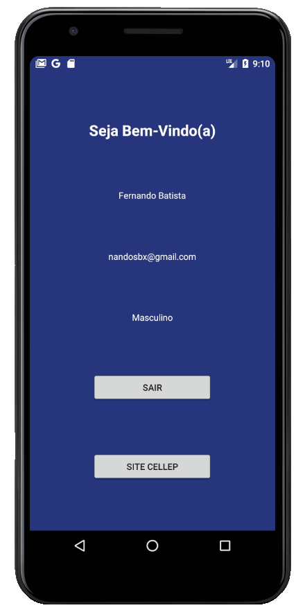

<h1 align="center">Cellep/Madcode/Estação Hack Kotlin App</h1>

 
   

<h2>	📷 MOBILE</h2></h2>

 

<h2>📖 About</h2>

Mobile application in Kotlin with login, register and link to Cellep's courses.

------------

<h2>🎓 Developed by</h2>
It was developed by Cellep/Madcode/EstaçãoHack.

------------

<h2>📃License</h2>

This project is under MIT License. Access <a href="https://github.com/Nandosbx/kotlin-cellep/blob/master/LICENSE.md">License</a> and learn more.

------------

<footer align="center">
 <strong align="center">Made with 💜 by Fernando Batista</strong>
</footer>